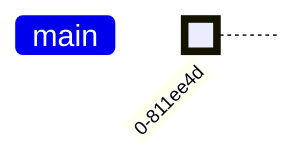

# TP2 – Dépôt

Dans ce TP nous allons mettre en place une gestion de version sur de la
documentation.

## Création de l’arboresence

```console
mkdir -p docs bin dist
```

## Premier fichier

### 💻 Installation de Codium

Pré-requis : [Configuration du serveur de mandataire pour snap](../../../proxy/proxy.md#snap).

```console
sudo snap install --classic codium
```

Source : [Site officiel de Codium](https://vscodium.com/#install)

### Création d’un alias Bash

```console
echo 'alias c.="codium ."' >> .bash_aliases
```

L’alias `c.` permet d’ouvrir Codium dans le répertoire courant de votre terminal.

```md title="docs/welcome.md"
# Bienvenue

## Impact sur Git
```

```console
git status
```

### État de versionnage

La commande `status` de Git est très pratique.
En effet celle-ci vous permet d’avoir facilement les renseignements suivants :

* Si vous avez des fichiers non suivis.
* Si vous avez des changements par rapport à votre dernière validation.
* La version où vous êtes.

### 📝 Journal des changements


## Première validation

Maintenant que vous avez créé un nouveau fichier et que vous êtes satisfait de
son contenu (du moins pour le moment). Vous allez pouvoir faire une première
version grâce à la commande `commit`.

### 💻 Éditeur par défaut

Beaucoup de logiciel notamment ceux en ligne de commande utilise la variable d’environnement `EDITOR`
afin de déterminer l’éditeur de texte à utiliser.

```console
export EDITOR=vim
```

Pour rendre persistante cette variable vous pouvez injecter cette ligne de commande dans votre `.bash_aliases`.

```console
echo 'export EDITOR=vim' >> ~/.bash_aliases
```

```console
git add docs
git status
```

### État de versionnage

Normalement votre prochaine validation gardera les changements apportés au fichier `docs/welcome.md`.
Car vous l’avez rajouté au suivi de version.

```console
git commit
```

### Éditeur de texte

La commande ci-dessus devrait vous faire apparaître un éditeur de texte
pour vous permettre de saisir un message pour votre première validation.

```console
git log
```

### 📝 Journal des changements

La commande `log` permet d’afficher le journal des changements.
Logiquement votre première version devrait apparaître.



### 🎆 Première version

Vous avez créé une première version de votre dépôt.
