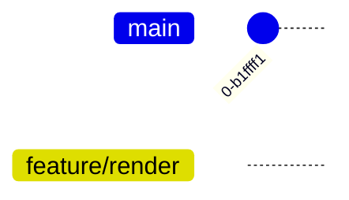
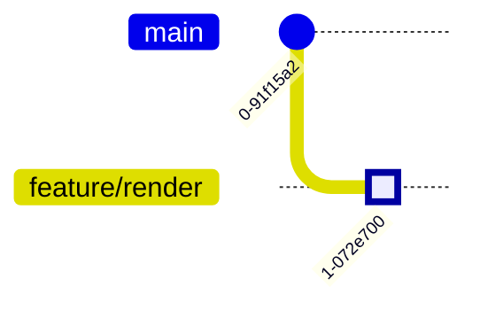
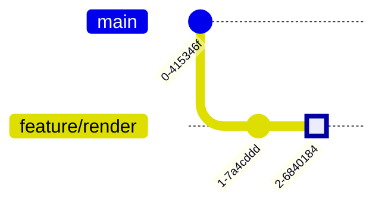
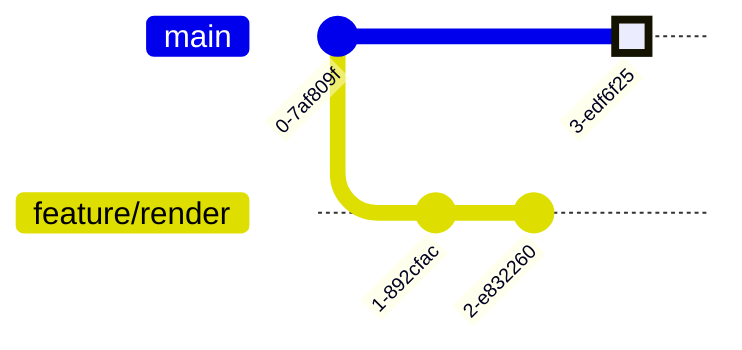
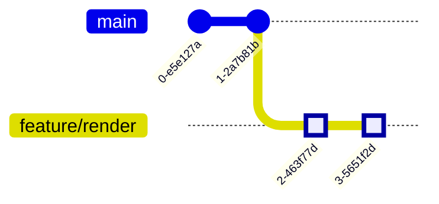
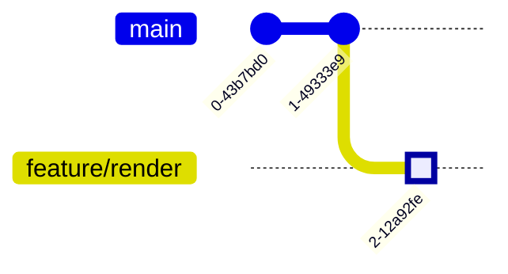
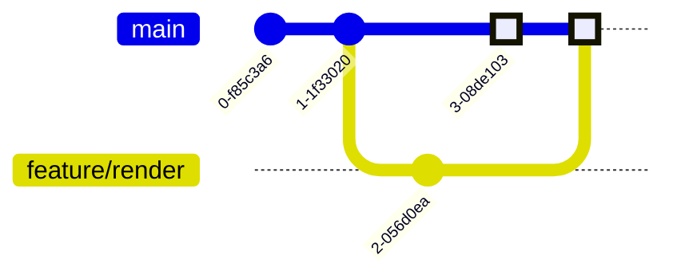
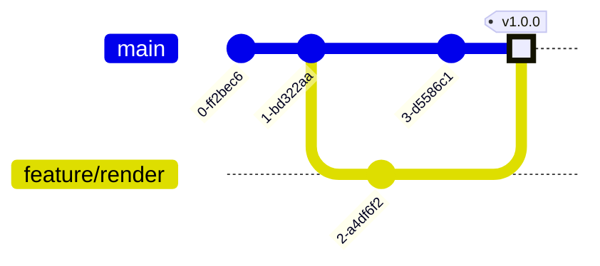

# TP3 – Branches

Les branches sont très pratiques pour les développements en parallèle.

Dans cet exemple on va rajouter une nouvelle fonctionnalité : **Le rendu HTML
des documents** pour cela on va se servir d’un
[Makefile](https://www.gnu.org/software/make/) et de
[Pandoc](https://pandoc.org/index.html) le couteau suisse des documents.

### 💻 Dépendances

Installation des dépendances via APT :

```console
sudo apt install pandoc make
```

## Création de la branche

Créons une nouvelle branche à partir de la branche principale.

```console
git checkout -b feature/render
git log
```

Vous verrez sur le journal des changements là où pointe votre nouvelle branche.

### 📝 Journal des changements



## Makefile

Création du Makefile

### 📍 Qu’est-ce qu’un Makefile ?

Un Makefile permet de définir des régles de construction et de les lancer uniquement si cela est nécessaire.
C’est-à-dire si la cible est plus récente que les fichiers sources.

Quelques liens :

* [Manuel GNU Make](https://www.gnu.org/software/make/manual/make.html)
* [Tutoriel de Developpez](https://gl.developpez.com/tutoriel/outil/makefile/)

Créez un ficher `Makefile` à la racine du projet avec le contenu ci-dessous :

```makefile title="Makefile"
--8<-- "docs/n-tiers/git/assets/Makefile"
```

Pour lancer la construction :

```console
make
```

### Supprimer les fichiers générés

Pour supprimer les fichiers générés :

```console
make clean
```

Puis ajouter le fichier et versionnez le avec les commandes suivantes :

```console
git add Makefile
git commit -m 'Add Makefile'
git log
```

### 📝 Journal des changements



## Ignorer des fichiers

Comme vous pouvez le voir Git souhaite versionner les fichiers HTML générés avec
le Makefile. Pour indiquer à Git que nous ne souhaitons pas suivre les changements
apportés à ces fichiers Nous pouvons créer un `.gitignore`.

### 📍 Comment ça marche ?

Un `.gitignore` est une liste de motif.
Si un fichier correspond à l’un des motifs
il est ignoré du suivis de version.

On peut mettre un `.gitignore` dans n’importe quel dossier.

On a la possiblité de rajouter des commentaire en commençant la ligne par une dièse `#`.

Nous pouvons créer des motifs négatifs en les préfixant par un point d’exclamation `!`.

```ini
# Ignore all yaml files
*.yml
# Except sample ones
!*.sample.yml
```

### "Gitignore global"

```ini title=".gitignore"
# Ignore generated html 
dist/*.html
```

### "Gitignore dans le dist"

```ini title="dist/.gitignore"
# Ignore generated html
*.html
```

Ajoutons le dossier `.gitignore` au suivi de version.

### 📝 Journal des changements



## Changement sur la branche principale

```console
git checkout master
git log
```

Modifions `welcome.md` et validons les changements sur la branche principale.

### 📝 Journal des changements



## Rembobinage changements

Sur Git les changements apportés sur la branche mère ne sont pas directement
integrés dans la branche fille.

### Rembobinage

```console
git rebase -i master
```

Le rembobinage permet de manipuler l’historique. Cette fonction est pratique
notament pour :

- Rattraper des changements de la branche mère.
- Changer de branche mère.
- Supprimer des versions.
- Éditer le message ou le contenu des versions.
- Fusionner des versions.

### 📍 Liste non exhaustive des commandes de rembobinage

La liste des commandes complète est disponible lors d’un rembobinage
interactif en commentaire des tâches à faire.

| Commande | Alias | Description                                                   |
| :------: | :---: | :------------------------------------------------------------ |
|  `pick`  |  `p`  | Ne rien faire.                                                |
| `reword` |  `r`  | Reformuler le message.                                        |
|  `edit`  |  `e`  | Éditer le contenu de la version.                              |
| `squash` |  `s`  | Fusion du commit avec le précédent.                           |
| `fixup`  |  `f`  | Fusion du commit avec le précédent en supprimant son message. |
|  `drop`  |  `d`  | Supprimer le commit.                                          |

Pour rattraper les changements, laisser tout vos commits à `pick`.

### 📝 Journal des changements



## Hébergement local

Avant de fusionner rajoutons un script permettant d’héberger le rendu HTML.

```bash title="bin/serve.sh"
--8<-- "docs/n-tiers/git/assets/serve.sh"
```

### 📍 Affichage direct de la page de bienvenue

Renommer `docs/welcome.md` vers `docs/index.md`.
Modifier en conséquence la dépendance de la cible `all` du Makefile vers `dist/index.html`.

## Fusion

### Préparation

Généralement on préfère fusionner les commits avant de les fusionner dans la
branche principale. En effet celle-ci sert au suivi du projet pour éviter un
surplus d’informations on cache les commits avec des changements purement
technique.

```console
git rebase -i "$(git merge-base feature/render master)"
```

### 📍 Qu’est-ce que c’est la commande `merge-base` ?

La commande `merge-base` permet d’obtenir l’identifiant du premier commit
en commun entre deux branches.

Afin d’indiquer les actions à faire lors de notre rembobinage l’éditeur de texte
par défaut devrait s’ouvrir.

### À faire dans le rembobinage

```git-rebase-todo
# Reformulation du message vers
# FEAT: Add build scripts
pick 74cbbbf Add Makefile
# Fusion du commit en ignorant son message
squash f9fa981 Add serve script
```

Ce qui nous permettra de fusionner les commit en un comme ci-dessous :

```
FEAT: Add HTML render

* Add Makefile
* Add serve script
```

### 📝 Journal des changements



### Intégration

Après avoir rendu notre historique propre en fusionnant des commits. Intégrons
les changements sur la branche principale à l’aide de la commande `merge`.

```console
git checkout master
git merge feature/render
git log
```

### 📝 Journal des changements



### 🎆 Fusion réussi !

Vous pouvez remarquer que en plus du commit de la branche `feature/render`
un autre commit représentant la fusion a bien été créé sur la branche principale.

## Étiquetage

Sur Git on peut étiqueter un commit pour le référencer plus facilement. La
plupart du temps les étiquettes permettent de donner un nom à une version.

On va respecter la gestion sémantique [Semver](https://semver.org/lang/fr/). En
étiquetant le dernier commit de la branche principale avec `v1.0.0`.

```console
git tag v1.0.0 main
git log
```

### 📝 Journal des changements



### 🎆 Première version !

Avec cette première version vous avez les bases de Git.
Sur le rembobinage vous n’avez eux aucun conflit
car Git est capable de les résoudre automatiquement.
Ce n’est pas toujours le cas malheureusement…

### 📍 Supression de la branche

Une fois que votre branche a été fusionnée avec la branche principale.
Il n’est pas rare de vouloir la supprimer car celle-ci devient inutile.

La commande suivante permet de supprimer la branche :

```console
git branch -D feature/render
```
