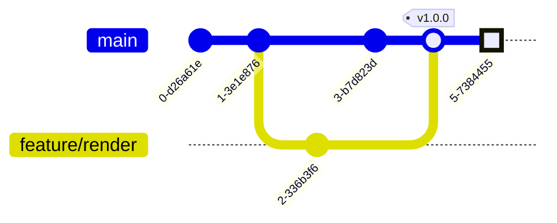
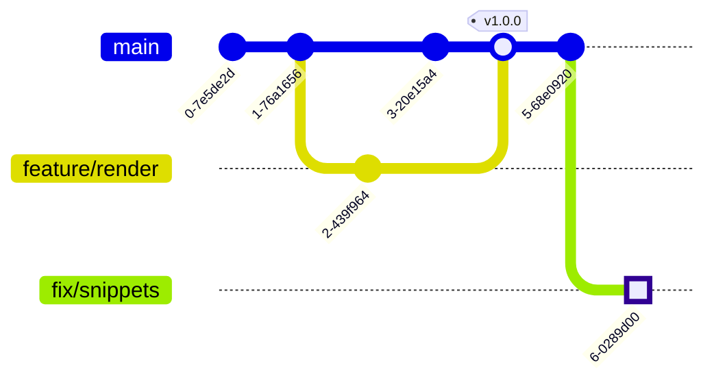
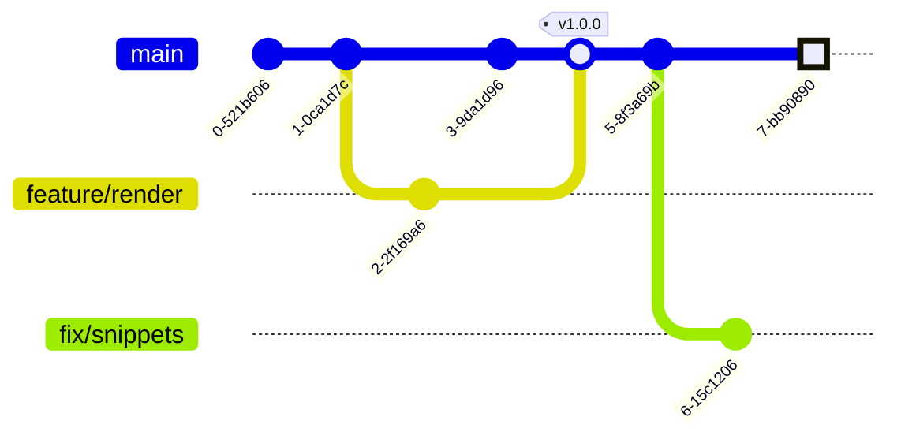
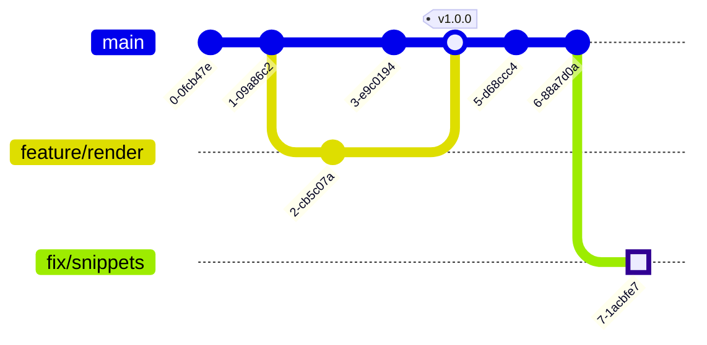
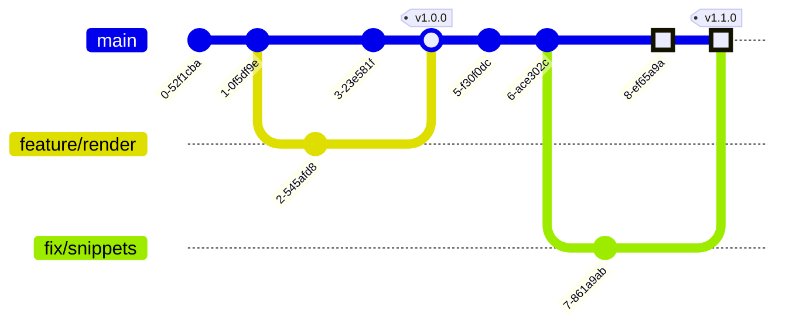

# TP4 – Les conflits

## Morceaux de code

Sur la branche principale créons le fichier `docs/snippets.md`. Avec ce plan :

```md title="docs/snippets.md"
# Snippets

## Typescript
```

## Fonction génératrice

Créons un morceau de code afin d’implémenter une première ébauche d’une
[fonction génératrice](https://developer.mozilla.org/fr/docs/Web/JavaScript/Reference/Statements/function*)
inspirée par la fonction
[`range`](https://docs.python.org/fr/3.8/library/stdtypes.html#range) de Python.

```ts title="range.ts"
/**
 * Generates an endless sequence of numbers.
 * @param min Minimal value
 */
function* range(min = 0): Generator<number> {
  for (;;) {
    yield min++;
  }
}
```

Validons cette première version.

### 📝 Journal des changements



## Création d’une branche

Notre fonction `range` contrairement à la version Python ne prend pas en compte
la borne de fin et le pas. Donc créons une branche pour corriger ce
comportement.

```ts title="range.fix.ts"
interface RangeOptions {
  start: number;
  stop: number;
  step: number;
}

/**
 * Generate sequence between two numbers.
 * @param options Options
 */
function* range(options: Partial<RangeOptions> = {}): Generator<number> {
  const { start, stop, step }: RangeOptions = {
    start: 0,
    stop: Number.MAX_SAFE_INTEGER,
    step: 1,
    ...options,
  };
  for (let i = start; i < stop; i += step) {
    yield i++;
  }
}
```

### 📝 Journal des changements



## Correctif à chaud

Parfois dans le développement logiciel nous devons appliquer un correctif urgent
sur la version en production. On dit alors qu’on crée un correctif à chaud
(hotfix en anglais).

Remplaçons la fonction `range` par celle-ci directement sur la branche
principale :

```ts title="assets/range.main.ts"
/**
 * Generates an sequence between two numbers.
 * @param min Minimal value
 * @param max Maximal value
 */
function* range(min = 0, max = Number.MAX_SAFE_INTEGER): Generator<number> {
  for (; min < max;) {
    yield min++;
  }
}
```

### 📝 Journal des changements



## Rattrape

Maintenant repartons sur notre branche correctif. Rattrapons la branche
principale.

### ❌ Conflits !

Vu que sur les deux branches nous avons modifié les mêmes lignes,
ceci va créer une situation de conflit que Git ne peut pas automatiquement gérer.

Alors que faire ?

Il faut choisir nous-même ce que nous souhaitons garder. N’hésitez pas à
**demander de l’aide à vos collègues** si vous n’êtes pas sûrs de se qu’il faut garder ou
non.

```diff
interface RangeOptions {
  start: number;
  stop: number;
  step: number;
}

/**
<<<<<<< HEAD
 * Generates an sequence between two numbers.
 * @param min Minimal value
 * @param max Maximal value
 */
function* range(min: number = 0, max: number = Number.MAX_SAFE_INTEGER): Generator<number> {
  for(; min < max;) {
    yield min++;
=======
 * Generate sequence between two numbers.
 * @param options Options
 */
function* range(options: Partial<RangeOptions> = {}): Generator<number> {
  const { start, stop, step }: RangeOptions = {
    start: 0,
    stop: Number.MAX_SAFE_INTEGER,
    step: 1,
    ...options,
  };
  for(let i = start; i < stop; i += step) {
    yield i++;
>>>>>>> 76c68cc... FIX(Snippets): Generate sequence between two numbers
  }
}
```

### 📝 Journal des changements



## Fusion

Vu que vous avez résolu les conflits pendant le rembobinage. Il n’y aura aucun
conflits pendant la fusion.

De cette façon on donne l’impression qu’il n'y a eu aucun conflit. En effet les
commits on été modifiés de manière à faire croire que la branche s’est toujours
basée sur la dernière version.

### 📝 Journal des changements



### 📍 Gérer des conflits

Pour éviter que les conflits soient trop compliqués,
je vous recommande de faire les plus petites versions possible.
De cette façon la cible des conflits sera plus petite
et par conséquent plus simple à lire.
